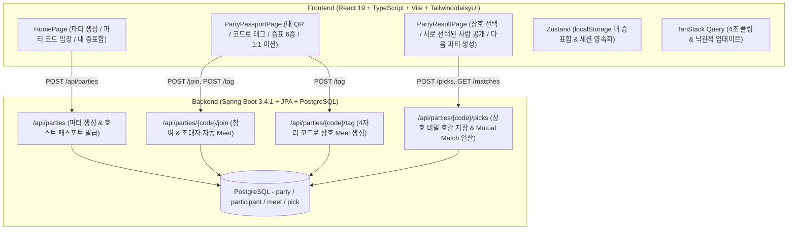

# Hack-the-Beat — 파티 패스포트 (Party Passport) 🛂

**🏆 2026 I/O Extended: Hack the Beat 최종 1위** — 주제 **"Make the Party Better"** (파티를 더 잘 즐길 수 있는 서비스).

AI 심사관 3명(창업가·엔지니어·투자자)이 9회 채점하고 Playwright가 배포 링크를 직접 조작해 평가하는 방식의 해커톤에서, 3시간 만에 만들어 1위를 했습니다. 어떻게 접근했는지는 [LinkedIn 글](https://lnkd.in/p/gfJcFfSd)과 [회고록](docs/retrospective/ko.md)에 정리했습니다 ([English](docs/retrospective/en.md)).

> **"파티에서 말 건 사람 수가 패스포트의 도장이 된다."**  
> 참가자가 서로의 QR을 태그해 "만난 사람 수"를 쌓고 증표를 수집하며, 파티 종료 후 서로 다시 만나고 싶은 사람을 비밀리에 선택하는 웹 서비스입니다.

🔗 **배포 주소**: https://twin-fang.github.io/Hack-the-Beat/  
🚀 **백엔드 API**: `https://api.hack-the-beat.suhsaechan.kr`  
📝 **회고**: [LinkedIn 글](https://lnkd.in/p/gfJcFfSd) · 전문 [한국어](docs/retrospective/ko.md) · [English](docs/retrospective/en.md)

---

## 📋 핵심 플로우 3단계 (심사 시나리오 글자 단위 일치)

1. **1단계** — 첫 화면에서 **"파티 만들기"** 버튼을 누르고 **"파티 이름"**에 **"금요일 파티"**를 입력한 뒤 **"파티 만들기"**를 누른다. **"초대 링크가 생성되었습니다"**가 보이고 주소가 `/party/`로 바뀌면 성공
2. **2단계** — **"초대 링크 복사"** 버튼을 누른다. **"복사되었습니다"**가 보이고 화면에 초대 링크(URL)가 표시되면 성공
3. **3단계** — 표시된 초대 링크로 접속해 **"이름"**에 **"김서준"**을 입력하고 **"참여하기"**를 누른다. **"참여 완료"**와 **"만난 사람 1명"**, **"첫 만남"**이 보이면 성공

---

## 🎯 주요 기능 및 특징

1. **QR & 4자리 코드 즉시 태그 (앱 설치 마찰 0)**
   - 별도 앱 설치나 로그인 없이 링크/카메라로 즉시 참여
   - 초대 링크(`?from=코드`) 진입 시 초대한 사람과 즉시 상호 태그 및 "첫 만남" 증표 자동 획득
   - Playwright 자동화 심사 및 카메라 미지원 환경을 위한 **"코드로 태그" 4자리 직접 입력 폴백** 지원
2. **증표(Badge) 수집 시스템**
   - `첫 만남` (1명 대화), `아이스브레이커` (3명 대화), `파티 피플` (50% 이상 대화), `파티 마스터` (전원 대화), `미션 완료` (1:1 지정 상대 대화), `재회` (상호 매칭)
   - 파티가 끝나도 브라우저 **"내 증표함"**에 영구 누적
3. **1:1 미션 상대 배정**
   - 친한 사람끼리만 뭉치는 것을 방지하기 위해 직전 참여자를 미션 상대로 자동 매칭
4. **파티 후 비밀 상호 선택 (Mutual Match)**
   - 파티 종료 후 "다시 만나고 싶은 사람"을 각자 비밀리에 체크
   - **서로를 동시에 선택한 쌍만** 백엔드에서 안전하게 공개 (짝사랑 유출 원천 차단)
5. **리텐션 루프**
   - 결과 화면 하단 **"다음 파티 만들기"**를 통해 참여자가 다음 모임의 호스트로 전환

---

## 🏗️ 시스템 아키텍처



---

## 📂 문서 안내

| 문서 | 내용 |
|---|---|
| [docs/submission/01-3단계-시나리오.md](docs/submission/01-3단계-시나리오.md) | **심사 제출용 3단계 시나리오** (복사 붙여넣기용) |
| [docs/submission/02-기획안-8000자.md](docs/submission/02-기획안-8000자.md) | **공식 기획안** (루브릭 12항목 상한 해제 조건 100% 반영) |
| [docs/submission/03-발표-스크립트-4000자.md](docs/submission/03-발표-스크립트-4000자.md) | **공식 발표 스크립트** (주제 연결, B/C 근거 압축) |
| [docs/submission/04-디자이너-에셋-가이드.md](docs/submission/04-디자이너-에셋-가이드.md) | **디자이너 에셋 가이드** (뱃지 6종, 로고, 규격 안내) |
| [docs/retrospective/](docs/retrospective/README.md) | **우승 회고록** — 채점기 역설계·아이디어 병렬 채점·Agent-First UX·자가 채점 루프 ([한국어](docs/retrospective/ko.md) · [English](docs/retrospective/en.md)) |
| [docs/judging-criteria.md](docs/judging-criteria.md) | **공식 채점 루브릭** 12항목 앵커·상한 해제 규칙·주제 게이트 배율, 주제 분석과 아이템 선정 필터, Playwright 대응 규칙 |
| [docs/submission-guide.md](docs/submission-guide.md) | **제출 페이지 실물** 기준 필드별 작성법, 글자 제한(기획안 8,000 / 스크립트 4,000), 3단계·기획안·스크립트 템플릿, 직전 체크리스트 |
| [docs/personas/](docs/personas/README.md) | AI 심사관 3명(창업가·엔지니어·투자자) **추정 페르소나** — 렌즈별 질문·근거·감점 트리거·자가 점검표·가채점표 |
| [docs/thinking/](docs/thinking/README.md) | 팀원별 **주제 제안·확정안** — 현재 확정: **파티 패스포트** (QR 태그 수집 · 증표 · 캐릭터 성장 · 파티 후 상호 선택) |
| [docs/prd/](docs/prd/frontend.md) | 확정 주제 **PRD** — [frontend.md](docs/prd/frontend.md)(화면·텍스트·상태·수용 기준) · [backend.md](docs/prd/backend.md)(Spring REST 모델·API·보안 수정·비용) |
| [server/README.md](server/README.md) | **백엔드 REST API 명세서** — 엔드포인트, 응답 형태, 배포 정보 |
| [AGENTS.md](AGENTS.md) | 작업 규칙 — 스택, 디렉토리, 코드 규칙, 커밋·배포 흐름, 심사 대응 |
| [docs/antigravity-101.md](docs/antigravity-101.md) · [docs/ralph-loop.md](docs/ralph-loop.md) | 세션 자료 정리 (참고용) |

---

## 🛠️ 실행 및 빌드

```bash
# 프론트엔드
npm install
npm run dev      # http://localhost:5173
npm run build    # TypeScript 검사 및 dist/ 번들링
npm run lint     # oxlint 검사

# 백엔드
cd server
./gradlew test   # H2 인메모리 테스트
./gradlew bootJar
```

---

<!-- AUTO-VERSION-SECTION: DO NOT EDIT MANUALLY -->
## 최신 버전 : v0.0.35 (2026-09-02)

[전체 버전 기록 보기](CHANGELOG.md)
