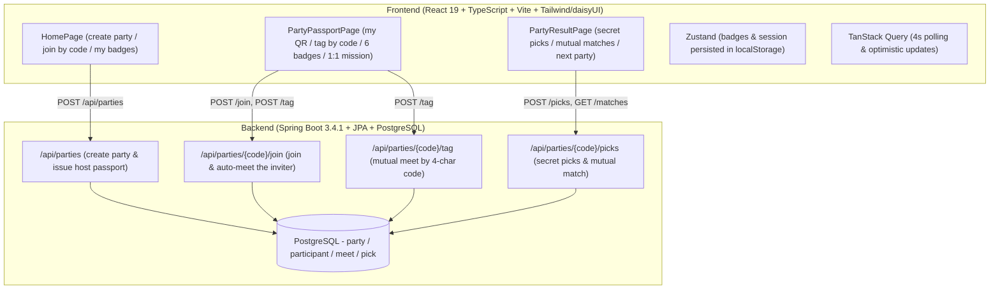
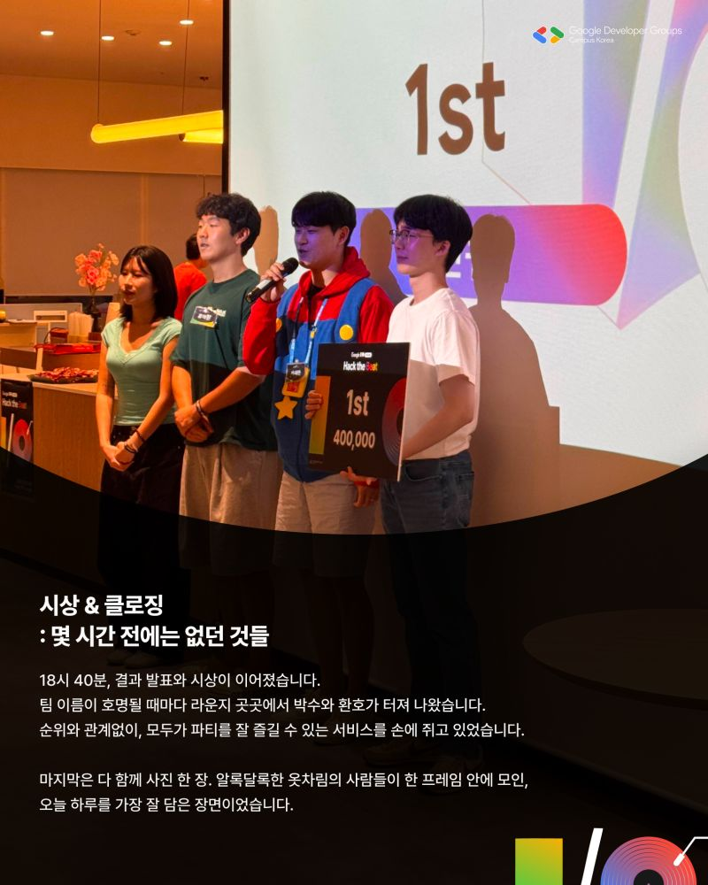

# Hack-the-Beat — Party Passport 🛂

**English** | [한국어](README.ko.md)

**🏆 1st place at 2026 I/O Extended: Hack the Beat** — theme: **"Make the Party Better."**

Built in about three hours for a hackathon where the judges were not human: three AI judges (founder, engineer, investor) scored the project nine times, and Playwright opened the deployed link and clicked through the app itself. How we approached it is in the [retrospective](docs/retrospective/en.md) ([한국어](docs/retrospective/ko.md)) and on [LinkedIn](https://lnkd.in/p/gfJcFfSd).

> **"Every person you talk to at the party becomes a stamp in your passport."**  
> Guests scan each other's QR codes to count the people they've met, collect badges along the way, and after the party secretly pick who they'd like to see again. Only mutual picks are revealed.

🔗 **Live demo**: https://twin-fang.github.io/Hack-the-Beat/ — no sign-up, no app install. The UI is in Korean.  
🚀 **Backend API**: `https://api.hack-the-beat.suhsaechan.kr`

<p align="center">
  
</p>

| Create a party | Your passport & QR | Join via invite link | Collect badges | Mutual match after the party |
|:---:|:---:|:---:|:---:|:---:|
|  |  |  |  |  |

<sub>Screenshots taken from the live service at mobile width (390px).</sub>

---

## 📋 The 3-step flow

The judges ran this exact scenario against the deployed app, so every button label and completion message matches it word for word (in Korean).

| Step | Action | Success signal |
|---|---|---|
| 1 | On the home screen, enter **"금요일 파티"** (*Friday Party*) as the party name and press **"파티 만들기"** (*Create party*) | **"초대 링크가 생성되었습니다"** (*Invite link created*) appears and the URL changes to `/party/` |
| 2 | Press **"초대 링크 복사"** (*Copy invite link*) | **"복사되었습니다"** (*Copied*) appears and the invite URL is shown |
| 3 | Open the invite link, enter **"김서준"** as the name, and press **"참여하기"** (*Join*) | **"참여 완료"** (*Joined*), **"만난 사람 1명"** (*1 person met*), and the **"첫 만남"** (*First Meeting*) badge appear |

---

## 🎯 Features

1. **Instant tagging with QR or a 4-character code**
   - Join from a link or camera, with no app install and no login
   - Opening an invite link (`?from=<code>`) tags you with the person who invited you and awards the *First Meeting* badge
   - A **"tag by code"** fallback for browsers without camera access, which is also what let the Playwright judge complete the flow
2. **Six badges**
   - *First Meeting* (1 person), *Icebreaker* (3 people), *Party People* (half the room), *Party Master* (everyone), *Mission Complete* (your assigned 1:1 partner), *Reunion* (a mutual match)
   - Badges stay in **"My Badges"** in your browser after the party ends
3. **1:1 mission partner**
   - Pairs you with someone you haven't met yet, so friends don't just stick together
4. **Secret mutual picks after the party**
   - Each guest privately checks who they'd like to meet again
   - The backend reveals **only pairs who picked each other**, so a one-sided pick is never exposed
5. **Retention loop**
   - **"다음 파티 만들기"** (*Create next party*) on the result screen turns any guest into the host of the next gathering

---

## 🏗️ Architecture


```mermaid
flowchart TD
    subgraph Client ["Frontend (React 19 + TypeScript + Vite + Tailwind/daisyUI)"]
        UI_Home["HomePage (create party / join by code / my badges)"]
        UI_Passport["PartyPassportPage (my QR / tag by code / 6 badges / 1:1 mission)"]
        UI_Result["PartyResultPage (secret picks / mutual matches / next party)"]
        Store["Zustand (badges & session persisted in localStorage)"]
        Query["TanStack Query (4s polling & optimistic updates)"]
    end

    subgraph Server ["Backend (Spring Boot 3.4.1 + JPA + PostgreSQL)"]
        API_Party["/api/parties (create party & issue host passport)"]
        API_Join["/api/parties/{code}/join (join & auto-meet the inviter)"]
        API_Tag["/api/parties/{code}/tag (mutual meet by 4-char code)"]
        API_Picks["/api/parties/{code}/picks (secret picks & mutual match)"]
        DB[(PostgreSQL - party / participant / meet / pick)]
    end

    UI_Home -->|POST /api/parties| API_Party
    UI_Passport -->|POST /join, POST /tag| API_Join
    UI_Passport -->|POST /tag| API_Tag
    UI_Result -->|POST /picks, GET /matches| API_Picks
    API_Party --> DB
    API_Join --> DB
    API_Tag --> DB
    API_Picks --> DB
```

---

## 📂 Documents

| Document | What's inside |
|---|---|
| [docs/retrospective/](docs/retrospective/README.md) | **Winning retrospective**: reverse-engineering the grader, scoring ideas in parallel, agent-first UX, the self-scoring loop ([English](docs/retrospective/en.md) · [한국어](docs/retrospective/ko.md)) |
| [server/README.md](server/README.md) | Backend REST API reference: endpoints, response shapes, deployment |
| [docs/submission/](docs/submission/) | What we submitted: 3-step scenario, proposal, pitch script, design asset guide (Korean) |
| [docs/judging-criteria.md](docs/judging-criteria.md) | The 12-item judging rubric and how we planned around it (Korean) |
| [docs/personas/](docs/personas/README.md) | Estimated personas for the three AI judges (Korean) |
| [docs/prd/](docs/prd/frontend.md) | PRDs: [frontend](docs/prd/frontend.md) and [backend](docs/prd/backend.md) (Korean) |
| [AGENTS.md](AGENTS.md) | Working rules: stack, directories, code conventions, commit and deploy flow (Korean) |

---

## 🛠️ Run locally

```bash
# Frontend
npm install
npm run dev      # http://localhost:5173
npm run build    # type-check and bundle into dist/
npm run lint     # oxlint

# Backend
cd server
./gradlew test   # in-memory H2 tests
./gradlew bootJar
```

---

## 📸 Event photos

The official recap from the organizers is on [LinkedIn](https://www.linkedin.com/feed/update/urn:li:ugcPost:7510266273977720832/).

<p align="center">
  
</p>

---

## 📜 License

[MIT](LICENSE)

---

<!-- AUTO-VERSION-SECTION: DO NOT EDIT MANUALLY -->
## 최신 버전 : v0.0.35 (2026-10-07)

[전체 버전 기록 보기](CHANGELOG.md)
