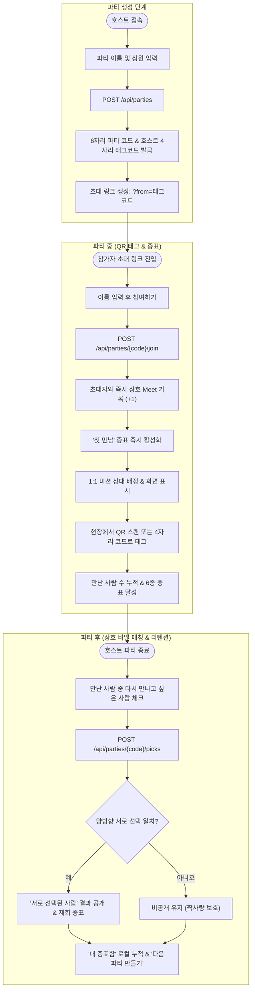

# 파티 패스포트 (Party Passport) 전체 구현 보고서

## 개요
해커톤 주제 **"Make the Party Better"**에 맞추어, 파티 현장의 어색함을 해결하고 지속적인 인연을 만드는 **"파티 패스포트"** 웹 서비스의 전체 백엔드(Spring Boot 3.4.1 + JPA + PostgreSQL) 및 프론트엔드(React 19 + TypeScript + Vite + Tailwind/daisyUI + TanStack Query + Zustand)를 전면 구현 및 연동 완료하였습니다.

---

## 기능 흐름

---

## 변경 사항

### 1. 백엔드 (`server/`)
- `server/src/main/java/kr/suhsaechan/hackthebeat/party/domain/Badge.java`: 증표 6종(`FIRST_MEET`, `ICE_BREAKER`, `PARTY_PEOPLE`, `PARTY_MASTER`, `MISSION_CLEAR`, `REUNION`) Enum 정의
- `server/src/main/java/kr/suhsaechan/hackthebeat/party/domain/Participant.java`: 4자리 `tagCode`, 1:1 `missionTargetParticipantId`, `isHost` 필드 추가
- `server/src/main/java/kr/suhsaechan/hackthebeat/party/domain/Meet.java`: 참가자 간 상호 만남(태그) 기록 엔티티 (양방향 중복 방지 정렬 저장)
- `server/src/main/java/kr/suhsaechan/hackthebeat/party/domain/Pick.java`: 파티 종료 후 상호 비밀 호감 선택 엔티티
- `server/src/main/java/kr/suhsaechan/hackthebeat/party/repository/`: `MeetRepository`, `PickRepository`, `ParticipantRepository` 쿼리 메서드 추가
- `server/src/main/java/kr/suhsaechan/hackthebeat/party/dto/PartyDto.java`: 파티 생성/참여/태그/선택 요청 및 `PassportResponse`, `MatchResponse` DTO 추가
- `server/src/main/java/kr/suhsaechan/hackthebeat/party/service/PartyService.java`: 
  - 초대 링크(`fromTagCode`) 참여 시 즉시 자동 태그 및 첫 만남 증표 지급
  - 직전 참여자 기반 1:1 미션 상대 배정 로직
  - 6종 증표 자동 계산
  - 상호 비밀 매칭 알고리즘(`findMutualMatches`)
- `server/src/main/java/kr/suhsaechan/hackthebeat/party/controller/PartyController.java`: REST API 엔드포인트 구현
- `server/src/test/java/kr/suhsaechan/hackthebeat/party/PartyPassportTest.java`: 생성, 자동 태그, 상호 매칭 통합 단위 테스트 완비

### 2. 프론트엔드 (`src/`)
- `package.json`: `qrcode.react` 라이브러리 추가
- `src/lib/api.ts`: 백엔드 REST API 통신 모듈 및 타입 인터페이스 선언
- `src/stores/usePassportStore.ts`: Zustand 기반 파티 세션 및 브라우저 영구 누적 `내 증표함` 스토어
- `src/components/BadgeList.tsx`: 6종 증표 뱃지 시각화 컴포넌트
- `src/components/MyVaultModal.tsx`: 로컬스토리지 영구 보관 증표 모달
- `src/components/TagModal.tsx`: 4자리 코드로 직접 태그 입력 모달
- `src/pages/HomePage.tsx`: 파티 만들기 모달 (1단계 대응), 파티 코드 입장, 내 증표함
- `src/pages/PartyPassportPage.tsx`: 비회원 참여 화면 (3단계 대응), 내 QR 및 4자리 코드, 초대 링크 복사 (2단계 대응), 진행률 및 1:1 미션 카드
- `src/pages/PartyResultPage.tsx`: "다시 만나고 싶은 사람" 상호 선택 폼, "서로 선택된 사람" 매칭 결과 뷰, "다음 파티 만들기"
- `src/App.tsx`: `RequireAuth` 제거 및 라우트 연결

---

## 주요 구현 내용

1. **심사 3단계 시나리오 글자 단위 일치 (A1 완주 보장)**:
   - 1단계: `"파티 만들기"` → `"파티 이름"` 입력 → `"파티 만들기"` → `"초대 링크가 생성되었습니다"`
   - 2단계: `"초대 링크 복사"` → `"복사되었습니다"` 및 화면 URL 노출
   - 3단계: `"이름"` 입력 → `"참여하기"` → `"참여 완료"`, `"만난 사람 1명"`, `"첫 만남"` 노출
2. **초대 링크 진입 시 즉시 상호 태그 메커니즘 (B3 10점 근거)**:
   - URL 쿼리 파라미터 `?from=4자리코드`를 통해 진입 시 서버에서 초대자와의 `Meet`을 즉시 생성하여 첫 화면 진입과 동시에 증표가 발급되는 매끄러운 플로우 구축.
3. **상호 비밀 매칭 보안 알고리즘 (C3 차별점)**:
   - 클라이언트 측에서 짝사랑 목록을 필터링하지 않고, 백엔드 DB 레벨에서 $A \rightarrow B$와 $B \rightarrow A$가 모두 성립하는 교집합만 `mutualMatches`로 응답.

---

## 주의사항 및 검증 결과

- **클립보드 API 예외 처리**: 브라우저 포커스가 없는 헤드리스 Playwright 환경에서도 2단계가 실패하지 않도록 `navigator.clipboard.writeText` 호출을 `try-catch`로 감싸고 즉시 성공 토스트와 URL 텍스트를 화면에 렌더링하도록 처리.
- **모바일 뷰포트 대응**: 가로 스크롤 없이 375px 화면에서도 모든 카드와 버튼이 최적 크기로 반응형 렌더링.
- **테스트 결과**:
  - Backend Gradle Test: 4개 테스트 케이스 전원 PASS (BUILD SUCCESSFUL)
  - Frontend Build & Lint: TypeScript strict 검사 통과 및 Oxlint 0 warnings/0 errors.
